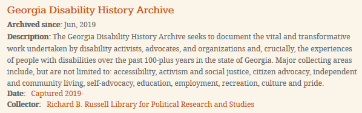
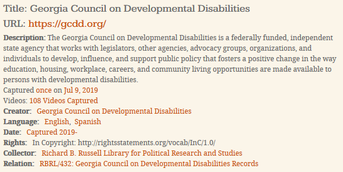
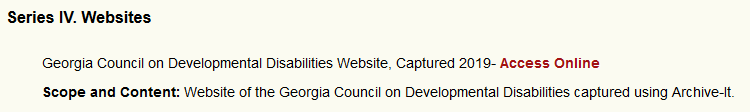

UGA Web Archives Metadata Profile, July 2019
============================================

# Purpose and Scope

Use this metadata profile to create consistent metadata for describing all archived websites and social media sites (hereafter "sites") at UGA to make it easier for researchers to work with content collected by multiple departments and easier to aggregate and share the metadata in other descriptive systems.

All descriptions of sites should follow these guidelines, regardless of the description platform. Sites must be described in the Archive-It interface and may also be described in other places, such as in the finding aid for a related collection, in a finding aid for a collection of sites, or in a catalog record.

A subset of these fields are used for describing collections in Archive-It. Most metadata fields are not used for collections because of the variation in the values for the field across sites in a collection.


# Background

The metadata is based on Dublin Core, since that is the metadata standard used by Archive-It, but can be mapped to EAD or other standards. Metadata fields chosen are based on the [OCLC Recommendations for Descriptive Metadata for Web Archiving (2018)](https://www.oclc.org/research/publications/2018/oclcresearch-descriptive-metadata.html), anticipated researcher needs, and practices of other institutions, particularly [Kansas State University](https://digitalcommons.usu.edu/westernarchives/vol8/iss2/4/), [New York Art Resources Consortium (NYARC)](https://sites.google.com/site/nyarc3/web-archiving/8-metadata-for-web-archives), [University of Virginia](https://docs.google.com/document/d/1M5kTUtUjob7YB7MpEd_Jl5lRsuZprxNZQZ6rELmJjeE/edit#heading=h.pz8x0vs3t9zo), and [Washington and Lee University](https://digitalcommons.usu.edu/westernarchives/vol8/iss2/2/).


# Metadata Fields

Extent will also be included once we have the ability to automatically generate it.


<table>
  <tr>
   <td><strong>Field</strong>
   </td>
   <td><strong>Required for Site</strong>
   </td>
   <td><strong>Required for Collection</strong>
   </td>
   <td><strong>Repeatable?</strong>
   </td>
  </tr>
  <tr>
   <td>Collector
   </td>
   <td>Yes
   </td>
   <td>Yes
   </td>
   <td>No
   </td>
  </tr>
  <tr>
   <td>Creator
   </td>
   <td>Yes
   </td>
   <td>No
   </td>
   <td>Yes
   </td>
  </tr>
  <tr>
   <td>Date
   </td>
   <td>Yes
   </td>
   <td>Yes
   </td>
   <td>No
   </td>
  </tr>
  <tr>
   <td>Description
   </td>
   <td>No
   </td>
   <td>Yes
   </td>
   <td>No
   </td>
  </tr>
  <tr>
   <td>Identifier
   </td>
   <td>Yes
   </td>
   <td>No
   </td>
   <td>No
   </td>
  </tr>
  <tr>
   <td>Language
   </td>
   <td>Yes
   </td>
   <td>No
   </td>
   <td>Yes
   </td>
  </tr>
  <tr>
   <td>Relation
   </td>
   <td>No
   </td>
   <td>No
   </td>
   <td>Yes
   </td>
  </tr>
  <tr>
   <td>Rights
   </td>
   <td>Yes
   </td>
   <td>No
   </td>
   <td>Yes
   </td>
  </tr>
  <tr>
   <td>Subject
   </td>
   <td>No
   </td>
   <td>No
   </td>
   <td>Yes
   </td>
  </tr>
  <tr>
   <td>Title
   </td>
   <td>Yes
   </td>
   <td>Yes
   </td>
   <td>No
   </td>
  </tr>
</table>


## Collector

* **Description:** Department that initiated the crawl.

* **Content Rules:** Hargrett Rare Book and Manuscript Library; Richard B. Russell Library for Political Research and Studies

* **Required:** Yes (site and collection). Used to filter the Archive-It collections page to the sites collected by a single department and so researchers know who to contact with questions.

* **Repeatable:** No. Only one department will be responsible for a crawl.

* **Mapping to EAD:** &lt;repository> with child &lt;corpname>


## Creator

* **Description:** Entity or entities primarily responsible for creating the content of the site.

* **Content Rules:** Library of Congress Name Authority File (LCNAF) or DACS Chapter 2.6 rules. Use "Anonymous" if authorship of the content is deliberately kept secret.

* **Required:** Yes (site).

* **Repeatable:** Yes. May have multiple entities with significant responsibility for the content of the site.

* **Mapping to EAD:** &lt;origination> with child &lt;corpname> or &lt;persname>


## Date

* **Description:** Year(s) the site was crawled. This is the most reliable approximation we have for the date of creation for most sites since it is the date the captured content was live on the web. If additional date information is known about the site, such as when it was first created, include that in the description. This field is automatically generated by Archive-It for sites and collections.

* **Content Rules:** For a one-time capture: Captured YYYY; for ongoing captures: Captured YYYY-

* **Required:** Yes (site and collection).

* **Repeatable:** No. Only use the date field for crawl dates.

* **Mapping to EAD:** &lt;unitdate normal="_YYYY_/_YYYY_">


## Description

* **Description:** Any additional information that provides context about the site which is not included in the other fields. Examples: information about the creator, the purpose of the site, the history of the site prior to the first crawl, the reason a site was archived, or any portion of the site that was not captured and why (out of scope, technical difficulties, etc.).

* **Content Rules:** None. This is a free text field.

* **Required:** Yes (collection). Collections need an explanation for why those sites are grouped together to aid users in browsing the collection list. In many cases, the title and creator are a sufficient description of a site and so the description field is not used.

* **Repeatable:** No.

* **Mapping to EAD:** &lt;scopecontent>


## Identifier

* **Description:** Unique identifier of the site. In Archive-It, the field is for internal use only and is not displayed to the public since it repeats information automatically added to the Archive-It record.

* **Content Rules:** URL to the calendar page for the site in the Wayback Machine. Archive-It does not have a unique uri for the description of the site or we would have used that.

* **Required:** Yes (site).

* **Repeatable:** No.

* **Mapping to EAD:** Do not include as an identifier because the url will be included for accessing the crawl as a related resource.


## Language

* **Description:** Primary language(s) of the content of the site.

* **Content Rules:** English term for the language from the [ISO 639.2 Code](http://www.loc.gov/standards/iso639-2/php/code_list.php).

* **Required:** Yes (site).

* **Repeatable:** Yes. Sites could have a significant amount of content in more than one language.

* **Mapping to EAD:** &lt;langmaterial> with child &lt;language langcode="_ISO 639-2 code_">


## Relation

* **Description:** Link between different descriptions for the site, e.g. Archive-It, finding aid, catalog record.

* **Content Rules:** Title and uri for the related resource.

* **Required:** No. Not all sites have related content, such as a student organization where we are only capturing the web presence of that group.

* **Repeatable:** Yes. A single site could have multiple related finding aids, a finding aid and a subject guide, etc.

* **Mapping to EAD:** &lt;dao href="_uri_">


## Rights

* **Description:** Rights information governing access or use of the crawled site.

* **Content Rules:** [Rightsstatement.org statement](https://rightsstatements.org/page/1.0/?language=en) or [Creative Commons License](https://creativecommons.org/licenses/) is required. Include both the title and URI so have human-readable information (the title) and a unique identifier (the URI). May optionally include local rights statements, e.g. if a site is embargoed or only accessible via the reading room.

* **Required:** Yes (site). Local rights statement is optional.

* **Repeatable:** Yes. Each rights statement is a separate instance of the rights field.

* **Mapping to EAD:** &lt;userestrict> for required statement; &lt;accessrestrict> if embargo or reading room.


## Subject

* **Description:** Main subjects of the content of the site and the type of site.

* **Content Rules:** LCNAF, LCSH, and AAT. Use local terms for names if not in LCNAF.

* **Required:** No. Title and creator may provide sufficient subject access.

* **Repeatable:** Yes.

* **Mapping to EAD:** &lt;controlaccess> with possible children &lt;corpname>, &lt;persname>, &lt;subject>, and &lt;genreform>. Use the source attribute to indicate the controlled vocabulary.


## Title

* **Description:** Succinct name for the site.

* **Content Rules:** If the site has a name (typically prominent text on the top of the homepage), use that for the title. Otherwise, use the site creator for the title. Add the type of site (e.g. Website, Facebook Page) to the end of the title to differentiate between multiple sites crawled for the same creator. The type of site may also be added to a title to clarify that it is a web resource, although this is typically understood from the context (e.g. it is in a web archives series in an archival collection).

* **Required:** Yes (site and collection).

* **Repeatable:** No.

* **Mapping to EAD:** &lt;unittitle>


# Description Examples


## Collection Description, Archive-It


View in the Archive-It public interface:



Metadata in Archive-It staff interface:

*   **Collector:** Richard B. Russell Library for Political Research and Studies

*   **Date:** Captured 2019-

*   **Description:** The Georgia Disability History Archive seeks to document the vital and transformative work undertaken by disability activists, advocates, and organizations and, crucially, the experiences of people with disabilities over the past 100-plus years in the state of Georgia. Major collecting areas include, but are not limited to: accessibility, activism and social justice, citizen advocacy, independent and community living, self-advocacy, education, employment, recreation, culture and pride.

*   **Title:** Georgia Disability History Archive

## Site Description, Archive-It

View in the Archive-It public interface:



Metadata in Archive-It staff interface:

*   **Collector:** Richard B. Russell Library for Political Research and Studies

*   **Creator:** Georgia Council on Developmental Disabilities

*   **Date:** Captured 2019-

*   **Description:** The Georgia Council on Developmental Disabilities is a federally funded, independent state agency that works with legislators, other agencies, advocacy groups, organizations, and individuals to develop, influence, and support public policy that fosters a positive change in the way education, housing, workplace, careers, and community living opportunities are made available to persons with developmental disabilities.

*   **Identifier:** https://wayback.archive-it.org/12264/*/https://gcdd.org/

*   **Language:** Spanish

*   **Language:** English

*   **Relation:** RBRL/432: Georgia Council on Developmental Disabilities Records

*   **Rights:** In Copyright: http://rightsstatements.org/vocab/InC/1.0/

*   **Title:** Georgia Council on Developmental Disabilities

## Site Description, Finding Aid

View in the online finding aid:



EAD:

```xml
<c01 id="aspace_ref352_6tt" level="series">
    <did>
        <unittitle>Series IV. Websites</unittitle>
        <unitdate>Captured 2019- </unitdate>
    </did>
    <c02 id="aspace_ref353_exu" level="file">
      <did>
        <unittitle>Georgia Council on Developmental Disabilities Website</unittitle>
        <unitdate>Captured 2019- </unitdate>
        <dao xlink:actuate="onRequest" xlink:href="https://wayback.archive-it.org/12264/*/https://gcdd.org/" xlink:show="new" xlink:title="Georgia Council on Developmental Disabilities Website" xlink:type="simple">
          <daodesc>
            <p>Georgia Council on Developmental Disabilities Website: Captured 2019-</p>
          </daodesc>
        </dao>
      </did>
      <scopecontent id="aspace_ab876e2560288d0e1263dd24ebda27f9">
        <head>Scope and Content</head>
        <p>Website of the Georgia Council on Developmental Disabilities captured using Archive-It.</p>
      </scopecontent>
	</c02>
</c01>
```

<!-- Docs to Markdown version 1.0β19 -->
